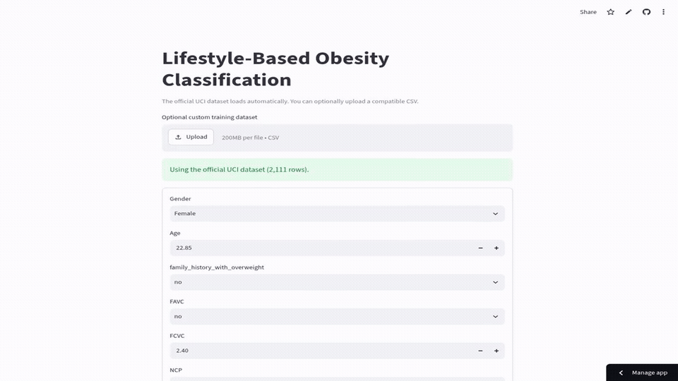

# Obesity Level Classification

[](https://karim797-obesity-classification.streamlit.app/)

Multiclass classification of seven obesity levels using a reproducible preprocessing pipeline, stratified splitting, cross-validation, tuning, baseline comparison, and error analysis. The deployable lifestyle-only track deliberately excludes Height, Weight, and BMI.



[Download the HD MP4 demo](assets/app-demo.mp4)

## Results

- Selected model: tuned Random Forest
- Test macro F1: **0.8464**
- Test accuracy: **0.8517**
- Majority-baseline accuracy: **0.1675**

## Technologies

Python, Pandas, NumPy, scikit-learn, Matplotlib, Seaborn, Joblib, Streamlit, Jupyter.

## Project Structure

```text
.
├── app.py
├── classification_project.ipynb
├── assets/app-demo.gif
├── assets/app-demo.mp4
├── requirements.txt
├── LICENSE
└── README.md
```

## How to Run

```bash
git clone https://github.com/Karim797/Obesity-Level-Classification.git
cd Obesity-Level-Classification
python -m venv .venv
source .venv/bin/activate  # Windows: .venv\Scripts\activate
pip install -r requirements.txt
streamlit run app.py
```

The app downloads the official UCI dataset automatically. A compatible CSV upload is optional. Open `classification_project.ipynb` to reproduce the full experiment.

## Responsible Use

This project is an educational machine-learning demonstration. Its predictions are **not medical advice or a clinical diagnosis**.

## License

Released under the [MIT License](LICENSE).
